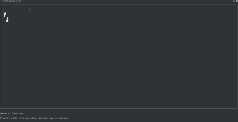
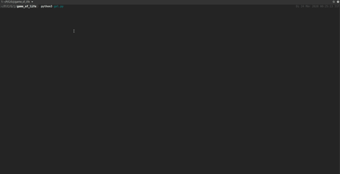
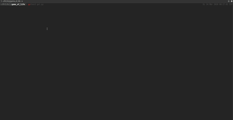
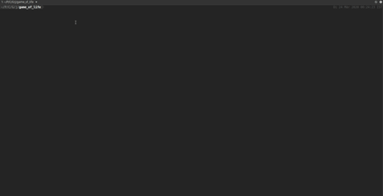

# Game of Life (in a Terminal!)

Based on [Conway's Game of Life](https://en.wikipedia.org/wiki/Conway%27s_Game_of_Life).


## Dependancies
You only need `NumPy` as external module.

The game uses python's built in [curses](https://docs.python.org/3/howto/curses.html) library to display graphics in Python.

## How To?
1. Start the game by running  ```python3 gol.py```
2. The game will fit the existing terminal screen. Follow the on screen instructions.
3. Select your initial pattern. Or just make it random.
4. Any key press will evolve the game. 
5. You can save the state by pressing 's' and quit the game by pressing 'q'


## Screenshots

Overview:




Random generation with saving game state:




Eater:




Glider Shooter:




#### Version 0.1